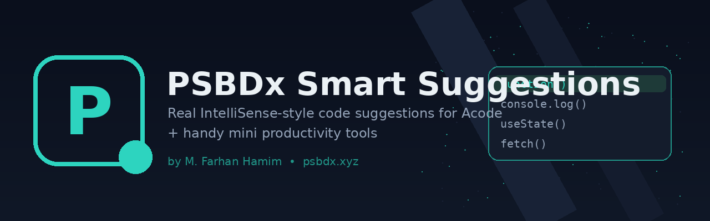

<div align="center">



<h1>PSBDx Smart Suggestions</h1>

<p>Real, IntelliSense-style code suggestions for <a href="https://acode.foxdebug.com">Acode</a> — plus a toolbox of small productivity commands.</p>

[](./changelogs.md)
[](#license)
[](https://acode.foxdebug.com)
[](https://psbdx.xyz)

<a href="https://github.com/psbdx-pvt-ltd/PSBDx-Smart-Sugestions">GitHub</a> ·
<a href="https://psbdx.xyz">psbdx.xyz</a> ·
<a href="#installing-this-plugin">Install</a> ·
<a href="#mini-features">Mini Features</a>

</div>

---

## ✨ Why this exists

Acode's built-in autocomplete is basically a keyword/word list — it doesn't
understand your code. **PSBDx Smart Suggestions** plugs into Acode's
built-in **LSP (Language Server Protocol)** engine, the same technology
VS Code runs on, so you get real symbol-aware completions, hover docs, and
diagnostics instead of guesses.

On top of that, it adds a **plain-text → code** expander and a handful of
one-tap mini tools for everyday editing.

<table>
<tr>
<td width="33%" valign="top">

### 🧠 Real IntelliSense
Registers language servers for JS/TS, HTML, CSS, JSON, Python & PHP so
completions are type/symbol-aware, not just word guesses.

</td>
<td width="33%" valign="top">

### ⌨️ Type text → get code
Type a plain description like `for loop` or `fetch api` on a line, hit
`Ctrl+Enter`, and it expands into real, language-correct code.

</td>
<td width="33%" valign="top">

### 🧰 Mini tools
Trim whitespace, duplicate lines, toggle case, word count, jump to TODOs,
and more — all from the command palette.

</td>
</tr>
</table>

---

## 🧠 Smarter suggestions (LSP)

| Language(s) | Server |
|---|---|
| JavaScript / JSX / TypeScript / TSX | `typescript-language-server` |
| HTML | `vscode-html-language-server` |
| CSS / SCSS / LESS | `vscode-css-language-server` |
| JSON | `vscode-json-language-server` |
| Python | `pylsp` |
| PHP | `intelephense` |

**Auto-install:** the plugin enables every server on load and tries to
trigger installation automatically in the background and again whenever you
switch to a matching file — no need to dig through Settings. Acode's public
plugin API doesn't (yet) document one guaranteed "silent install" call, so
this is best-effort: if a server still isn't installed, Acode falls back to
its normal one-tap install prompt the moment you open a matching file. You
can also run **PSBDx: Install All Suggestion Servers** any time from the
command palette to retry all of them at once.

## ⌨️ Plain text → code

Type a short, plain-English description on its own line, then run
**PSBDx: Smart Text → Code** (`Ctrl+Enter` / `Cmd+Enter`) — the line is
replaced with real code, matched to your current file's language.

```text
for loop            →  for (let i = 0; i < 10; i++) { ... }
fetch api            →  fetch('https://api.example.com/data')...
function called add  →  function add() { ... }
class named User     →  class User { constructor() { ... } }
try catch            →  try { ... } catch (error) { ... }
hello world          →  console.log("Hello, World!");
```

Supported phrases include: `hello world`, `for loop`, `while loop`,
`function` / `function called X`, `arrow function`, `class` / `class named X`,
`if else`, `try catch`, `read file`, `fetch` / `http request` / `api call`,
`sort array`, `reverse string`, `sum array`, `fibonacci`, `swap`,
`random number`, `current date`, `main function`, `array`, `dictionary` /
`object`, `import`, `html boilerplate`, `flex center`. Output adapts to
JavaScript, TypeScript, Python, Java, C, C++, PHP, HTML or CSS based on the
open file's extension.

## 🧰 Mini features

Available from the command palette:

| Command | What it does |
|---|---|
| **PSBDx: Trim Trailing Whitespace** | Strips trailing spaces/tabs on every line |
| **PSBDx: Duplicate Current Line** | Duplicates the line under the cursor (`Ctrl+Shift+D`) |
| **PSBDx: Toggle Case of Selection** | Flips selected text between UPPER and lower case |
| **PSBDx: Insert Date & Time** | Inserts the current date/time at the cursor |
| **PSBDx: Word & Character Count** | Toast with word/char/line counts (selection or whole file) |
| **PSBDx: Wrap Selection in console.log()** | Quickly wraps the selection for a debug print |
| **PSBDx: Jump to Next TODO / FIXME** | Cycles the cursor to the next `TODO`/`FIXME` in the file |
| **PSBDx: Install All Suggestion Servers** | Retries auto-install for every language server |
| **PSBDx: Smart Text → Code** | Expands a plain-text line into real code (`Ctrl+Enter`) |

---

## 📦 Installing this plugin

1. Grab the release zip from the [GitHub repo](https://github.com/psbdx-pvt-ltd/PSBDx-Smart-Sugestions), or zip this folder yourself — `plugin.json`, `main.js`, `readme.md`, `icon.png`, `banner.png`, `changelogs.md` must sit at the **root** of the zip, not inside a subfolder.
2. In Acode: **Settings → Plugins → Install from device** and pick the zip.
3. Open a JS/TS/HTML/CSS/JSON/Python/PHP file — Acode will prompt to install the matching language server if it isn't already set up.

## ✅ Requirements

- A recent Acode build on the **CodeMirror 6** engine (checked automatically via `editorManager.isCodeMirror`; older Ace-based builds will get a heads-up toast).
- Acode's built-in runtime needs to be able to install npm/pip packages (built-in Alpine environment, or Termux depending on your device setup) — the same mechanism any LSP-powered Acode plugin relies on.

## 🛠️ For developers

`minVersionCode` in `plugin.json` is `1002`. If Acode reports the plugin as
incompatible, lower it to match your installed Acode's version code
(**Settings → About**). Source, issues and PRs: [github.com/psbdx-pvt-ltd/PSBDx-Smart-Sugestions](https://github.com/psbdx-pvt-ltd/PSBDx-Smart-Sugestions).

## License

MIT — see [LICENSE](https://github.com/psbdx-pvt-ltd/PSBDx-Smart-Sugestions/blob/main/LICENSE).

<div align="center">
<sub>Built by <a href="https://psbdx.xyz">M. Farhan Hamim</a> — PSBDx</sub>
</div>
